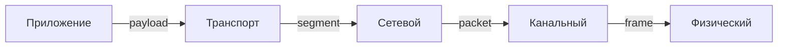

# Понятие уровня, протокола, инкапсуляция

> Кратко: уровень описывает ответственность; протокол — правила обмена; инкапсуляция — упаковка данных в заголовки/хвосты нижних уровней.

### 1. Определения

* **Уровень** — логическая граница с набором сервисов для вышележащего уровня и набором протоколов для обмена с одноуровневыми сущностями.
* **Протокол** — формальный набор правил: формат сообщений, семантика полей, порядок обмена, обработка ошибок и временные параметры.
* **Инкапсуляция** — процесс упаковки данных верхнего уровня в протоколы нижнего уровня с добавлением служебной информации.

### 2. Сервис vs Протокол (ясно и коротко)

* **Сервис** отвечает на вопрос "что" доступно вышестоящему уровню (напр. доставка байтов между сокетами).
* **Протокол** отвечает на вопрос "как" (какие поля, кто отправляет ACK, какие таймауты).

Пример: сервис L4 — доставка сегмента приложению; протокол TCP реализует этот сервис через заголовки, флаги, состояния.

### 3. Единицы данных по уровням

* L7: сообщение/HTTP-пакет (payload приложений).
* L4: сегмент (TCP) / датаграмма (UDP).
* L3: пакет / датаграмма (IP).
* L2: кадр (frame, Ethernet).
* L1: биты на среде.

### 4. Поля заголовков — короткие примеры

* Ethernet: `DstMAC | SrcMAC | EtherType | Payload | FCS`.
* IPv4: `Version|IHL|TTL|Protocol|SrcIP|DstIP|Payload`.
* TCP: `SrcPort|DstPort|Seq|Ack|Flags|Window|Checksum|Options|Payload`.

### 5. Процесс инкапсуляции и декапсуляции

1. Приложение формирует сообщение.
2. Транспорт добавляет порт/поля надёжности → сегмент.
3. Сеть добавляет IP-заголовок → пакет.
4. Канальный уровень формирует кадр с MAC и CRC → кадр.
5. Физический уровень передаёт биты.

При приёме порядок обратный. Ошибка в любом звене приводит к диагностике на соответствующем уровне.

### 6. Поведение протоколов: состояния и тайминги

* Протоколы описывают конечные автоматы (например, TCP: LISTEN→SYN\_SENT→ESTABLISHED→CLOSE).
* Таймауты и ретрансляции критичны. Настройка RTO влияет на производительность и надёжность.
* Идём по логике: формат + состояние + таймауты = полное поведение.

### 7. Диагностика: что смотреть на каждом уровне

* L1: кабель, свет/сигналы, duplex, link LED.
* L2: MAC-адреса, VLAN, ARP, кадры на интерфейсе.
* L3: IP-адреса, маршрутизация, TTL, ICMP.
* L4: порты, состояние сокетов, retransmits, window.
* L7: логика приложения, форматы сообщений, авторизация.

### 8. Практические фильтры Wireshark/tcpdump

* По IP: `ip.addr == 192.168.1.10`.
* По TCP-порту: `tcp.port == 443`.
* По MAC: `eth.addr == 00:11:22:33:44:55`.
* Для поиска SYN без ACK: `tcp.flags.syn==1 && tcp.flags.ack==0`.

### 9. Краткие примеры задач и решений

* Приложение не получает данные, но пакеты в сети есть → смотреть L4 (порты, firewall).
* Нет ARP-ответа → смотреть L2 (кабель, MAC, VLAN).
* Маршрутизация падает → смотреть L3 (route table, next hop).

### 10. Экзаменационные тезисы

1. Уровень = ответственность + сервисы.
2. Протокол = правила обмена + поведение.
3. Инкапсуляция — упаковка сверху вниз; декапсуляция — обратный процесс.
4. Диагностика делится по уровням.

### 11. Вопросы для самопроверки

1. Чем отличается сервис уровня от протокола?
2. Какой заголовок добавляет маршрутизатор при фрагментации IPv4?
3. Почему TTL уменьшается на маршрутизаторе?
